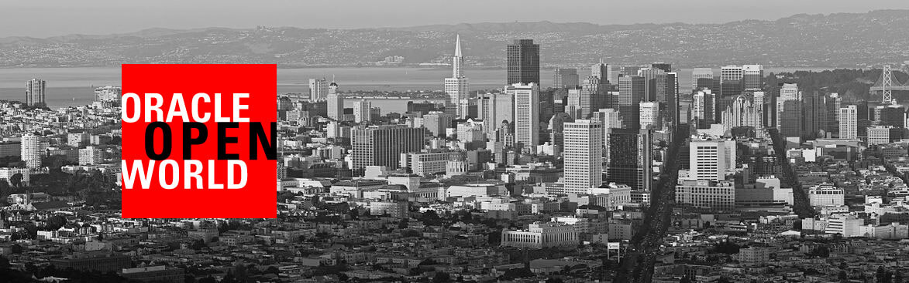

## HOL6285: Application Container Cloud Service - 101 ##

#### About this hands-on workshop ####

This hands on lab demonstrates how to deploy and run Microservices style application on Application Container Cloud which provides a lightweight infrastructure so that you can run applications in the Oracle Cloud.

Oracle Application Container Cloud Service lets you deploy Java SE, Java EE web, Node.js, PHP, Python, Ruby, Go, and .NET Core applications to the Oracle Cloud. Your application runs in a Docker container.

The demo application is a simple Credit Scoring application written in Java SE using [Helidon](https://helidon.io) (backend) and AngularJS (UI) frameworks. The application calculates the credit score based on name, date of birth and SSN.

Oracle services being used during the hands-on are the following:

+ Oracle Application Container Cloud
+ Developer Cloud Service

#### The topics to be covered in this hands-on session are: ####

1. [Build and deploy sample application to Application Container Cloud using Developer Cloud Service](devcs.accs.md)

2. [Deploy sample application to Application Container Cloud Services from a Git Repository](github.deploy.accs.md)
