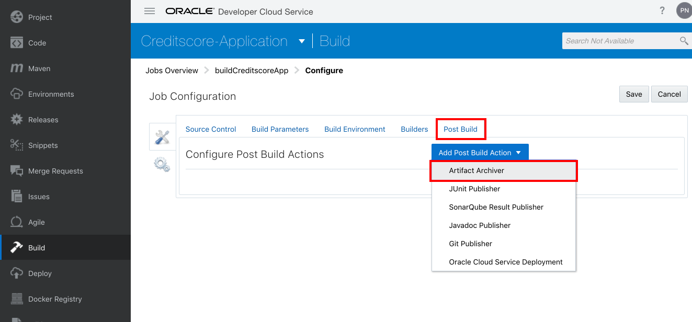
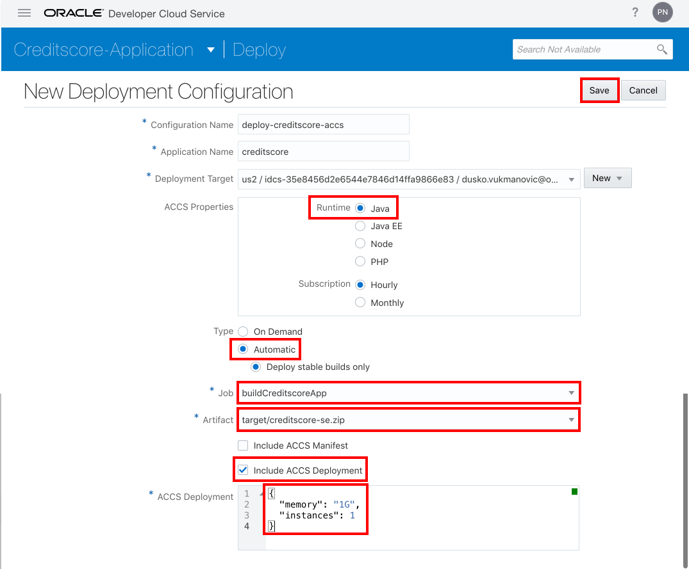

## Build and deploy Creditscore demo application to Application Container Cloud Services using Developer Cloud Services ##

### About this tutorial ###
**Oracle Application Container Cloud Service** lets you deploy Java SE, Node.js, PHP, Python, Ruby, Go, and .NET Core applications to the Oracle Cloud. You can also deploy Java EE web applications. Your application runs in a Docker container.

**Oracle Developer Cloud Service** is a cloud-based software development Platform as a Service (PaaS) and a hosted environment for your application development infrastructure. It provides an open-source standards-based solution to develop, collaborate on, and deploy applications within Oracle Cloud.

This tutorial demonstrates how to create Oracle Developer Cloud Service project and build and deploy application to Oracle Application Container Cloud Service.

The Creditscore demo application has [AngularJS](https://angularjs.org/) UI and [Helidon](https://helidon.io) backend service.

### Prerequisites ###

- An [Oracle Cloud](https://cloud.oracle.com) account with access to Oracle Application Container Cloud Service. (Instructor will assign account for you.)

----
#### New Developer Cloud Service Setup ####

Oracle Developer Cloud Service now supports integration with Oracle Cloud Infrastructure Compute Classic and Oracle Cloud Infrastructure Object Storage Classic.

You can create virtual machines (VMs) on Oracle Cloud Infrastructure Compute Classic and use them to run builds of your projects. The archived build artifacts are stored on the containers of Oracle Cloud Infrastructure Object Storage Classic.

If you haven't opened Developer Service Console yet then visit [https://cloud.oracle.com](https://cloud.oracle.com) and sign in using your credentials. Click **Sign In**.

Enter your cloud account name and click **My Services**.

Enter the cloud account credentials. Before you click **Sign In** please note your identity domain id what can be found in the URL belongs to authorisation page. This id is necessary later to define Application Container Cloud connection.

Select **Developer Cloud Service** in the left menu.

Select your Developer Cloud Service instance and click the menu icon on the right side and select **Access to console**.

If you don't have already a Developer Cloud Service instance than you have to create instance, click on **Create Instance** button:

Only parameter you should define is an instance name, click **Next** and **Confirm**:

After few minutes instance will be ready and you can access to Developer Cloud Service instance.

At the first access the Developer Cloud Service Instance warn you to configure Compute and Storage.

##### Configure a connection to Oracle Cloud Infrastructure Storage Classic #####

To configure storage click the **Storage** link in the warning message or click the user icon on the top right corner, select **Organisation** then click **Storage** tile.

Click **New Configuration**.

In order to collect information needed for Storage setup go back to Oracle Cloud Services dashboard. Click **Dashboard** and if you can not see *Storage Classic* tile then click **Customize Dashboard** and set *Show* at *Storage Classic* dashboard item.

On the *Storage Classic* service click the menu and select **View Details**.

Here you can find related Storage information:

Once you have the necessary parameters go back to the new configuration of Storage connection and fill the necessary parameters. Username and Password is your Oracle Cloud credentials. (Username: *cloud.admin*). The Storage configuration should look similar:

Click **Save**.

##### Configure a connection to Oracle Cloud Infrastructure Compute Classic #####

To use build executor first you have to configure Compute (Classic) access for Developer Cloud Service where the build VM can run.

To create Compute (Classic) service access click **Virtual Machines** in the left menu and click **+Configure Compute Account**. (You can use the User icon on the top right corner to navigate to Virtual Machines page. Click user icon, select **Organisation** then click **Virtual Machines** tile.)

In order to collect Compute (Classic) information, go back to the Oracle Cloud Service dashboard and find *Compute Classic* service click menu and select **View Details**. If you can't find the *Compute Classic* tile click **Customise Dashboard** and set *Show* for *Compute Classic* entry.

On the details page you can find related Compute information:

Once you have the necessary parameters go back to the new configuration of Compute Account configuration and fill the necessary parameters. Username and Password is your Oracle Cloud credentials. (Username: *cloud.admin*) The Compute Account configuration should look similar:

Click **Save**. The Developer Cloud Service instance configuration is done.

#### Setup Developer Cloud Service Build Executor VM ####

In order to execute application build Developer Cloud Service uses compute instances what needs to be prepared before build job creation. Creditscore application is built using Java SE and defined in Maven project. To build deployable application artifact you need Java/Maven/Git capable build executor VM. To have such VM instance first you need to define VM template what you can instantiate for Developer Cloud Service.

In the Oracle Developer Cloud Service user interface, click the user name in the top-right corner and select **Organization**.

In the Organization Administration page, click **VM Templates**.

In the Build VM Templates page, click **New Template**.

In the New VM Template dialog box, enter the following details and click **Create**.
+ **Name**: *JavaBuildTemplate*
+ **Description**: *A Build VM template with minimum required software*
+ **Platform**: *Oracle Linux 7*

When a Build VM Template is created, it contains the minimum software required to run basic builds. You can add additional software to the template, if necessary.

As the minimum template contains all the neccessary components you just check the software configuration and option of the Build VM Template.

On the right side of the page, click **Configure Software**.

In the Configure Software page check what components available in the *Required Build VM Components*. Please note what other runtimes, tools and frameworks are available to create build VM. Click **Done** or **Cancel** to close the VM configuration.

The build VM Templates define the operating system and the software installed on the Build VM and are used by the build system when running builds. To configure Oracle Developer Cloud Service to use Build VM instance, you must do the following.

Open the Virtual Machines page of your organization. You can use the left side bar menu. Click **+New VM**.

In the Add Build VM dialog box enter the following:
+ **Quantity**: 1 (the number of VMs you want to allocate)
+ **VM Template**: select the *JavaBuildTemplate* Build VM template.

Click **Add**.

Check the new entry in the Build VMs list. Now the Build VM is ready to use.

#### Create Developer Cloud Service project ####

Go back to the Developer Cloud Service instance console page. If you are still on the DevCS Organization page click the **Developer Cloud Service** header.

To create a new project for Creditscore application click **+New Project**.

Choose a project name. For example: *Creditscore-Application*

Select **Initial Repository** as template. The reason to use this template to clone the application sources during the project creation. However you can clone and/or add external repository later.

Select **Import existing repository** and copy or write: *https://github.com/nagypeter/angular-helidon-creditscore.git*. Click **Finish**

Wait until the project provision is done.

#### Create build job to compile and package the Creditscore application ####

A Job is a configuration that defines the software builds of your software application in the Oracle Developer Cloud project. In this tutorial, you create a job that runs Maven goals and archives the Creditscore application build artifact. To run a job you need to use a predefined Oracle Developer Cloud Build VM. VMs run on Oracle Linux 6 and Oracle Linux 7, and support a variety of software such as Node.js, Docker, and Oracle SOA Suite. The platform and the software in Build VMs are defined by Build VM templates.

Using the left menu select the **Build** page. Click **+New Job**.

Enter a job name: *buildCreditscoreApp*. Leave the default **Create New** option. Select your predefined (*JavaBuildTemplate*) software template which can execute a Maven build.

The configuration page of the job appears. The first step is to add the application sources to this job. Click **Add Source Control** and select **Git**.

Select the available Creditscore application Git repository.

Change to **Builders** tab to define build step. Click **Add Builder** and select *Maven Builder*.

Leave the default *clean install* Maven goals and *pom.xml* project file.

The Maven build step configuration basically is complete. But after the successful build you need to store the artifact (zip file) for later deployment. Switch to **Post Build** tab, click **Add Post Build Action** and select *Artifact Archiver* action.

Define **target/*.zip** filter which ensures the deployable zip artifact archive. Click **Save** to store the job configuration.

The job is now ready to execute. Click **Build Now** to start the job.

Most likely the first execution requires more time because the executor VM needs to be instantiated based on the template. When the VM is ready the executor will be assigned to run the build job. Once it is done you should see the green (successful run) status in the build history. Click the **Artifacts** icon to check the archive result.

Open the target folder and check the *creditscore-se* ACCS deployable zip file.

#### Deploy Creditscore application to Application Container Cloud Service ####

The deployable artifact is ready and available on the storage configured for Developer Cloud Service Project. The next step is to define *Deploy Configuration* (Application Container Cloud Service target) to deploy and run the application.

Change to **Deploy** page using the left quick menu bar. Click **+New Configuration**

Fill out the following:

+ **Configuration Name**: *deploy-creditscore-accs*
+ **Application Name**: *creditscore* (Important: use only alphanumerical characters only. No dash, slash, etc.)
+ **Deployment Target**: Click **New** and select *Application Container Cloud...*

Fill out the following:

+ **Data Center**: provided by the instructor or can be found in the details of your cloud account.
+ **Identity Domain**: the id what you noted during the sign in process. See above.
+ **Username**: your cloud account username
+ **Password**: your cloud account password

Click **Test Connection**.

When the test succeeded click **Use Connection**.

Fill out the rest of the parameters:
+ **Type**: *Automatic*
+ **Job**: the only one available you defined above; *buildCreditscoreApp*
+ **Artifact**: the available *target/creditscore-se.zip* archive.
+ **Include ACCS Deployment**: No. The archive already contains the *deployment.json*
+ **Include ACCS Deployment**: Yes. To decrease default resource consumption (2GB memory and 2 OCPU) copy or write the following JSON formatted properties:

		{
			"memory": "1G",
			"instances": 1
		}

Click **Save**.

To initiate deployment without execute the build job again click the settings (gear) icon and select *Redeploy*.

The manual redeployment will ask which build's output needs to be used for the deployment. Select the available #1 build and it's archived artifact. Click **Deploy**

Open the Application Container Cloud console and check your Creditscore application deployment. To open go back to your cloud services dashboard and select **Application Container Cloud Service**.

Once the deployment is done check your application. Click the URL to access Creditscore application.

Test the application. Fill out the name, date of birth and ssn number and click **Score** to calculate credit score.

